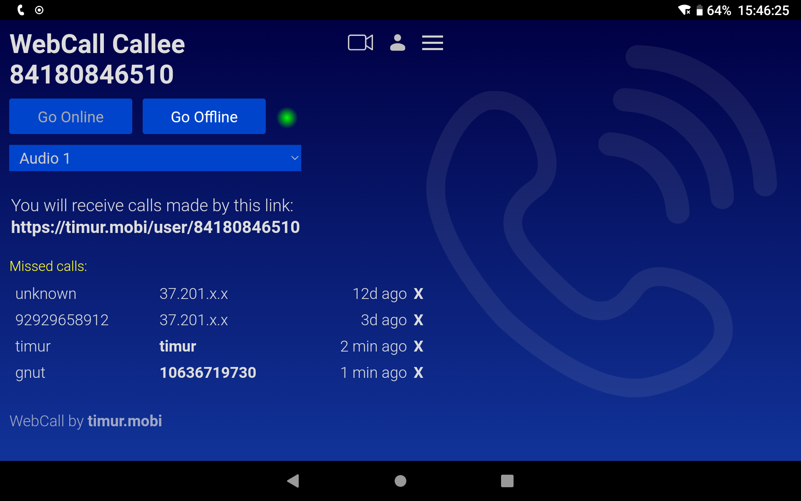

<div align="center">
  <a href="https://timur.mobi/webcall/android"></a>
</div>

# WebCall for Android

WebCall for Android offers the following features on top of the core WebCall package:

- NFC Connect
- Ring on speaker
- Receiving calls while in deep sleep
- Automatic use of ear piece if available
- Proximity sensor to turn off backlight
- Low battery consumption

WebCall for Android offers all WebRTC 1.0 based audio/video telephony features as provided by the core WebCall client. This includes low latency E2E-encrypted P2P communications and very high audio quality using the Opus codec (two-way 20-280kbp/s). Find out more about [Core WebCall.](https://github.com/mehrvarz/webcall/)


When you run the WebCall client, anybody on the Web can give you a call. Your callers only need to know your personal WebCall link (your WebCall "phone number").

### NFC Connect

NFC Connect lets you establish phone calls by touching two devices. Once connected the two parties can split and walk away, while continuing the call. The other device does not require any special software. It only needs internet (mobile or wifi), NFC and a 2020+ web browser. If both devices are connected to the same Wifi network, the call will establish directly over Wifi.

### Ring on Speaker

WebCall for Android can play back the ringtone on the loud speaker, even if you have a headset connected. If you intend to use a headset, this feature can simplify picking up calls a lot.

### Receiving calls while in sleep mode

WebCall for Android lets you receive calls while your device is in deep sleep mode. This is something the Web client does not support. It makes the Android client a much better solution for all day operations.

### Low power requirements

WebCall for Android has very moderate power requirements. It can run in the background all day in order to receive calls at any time. Unlike a regular phone application, it does not require a SIM card.

## More info + APK Download

You can use WebCall for Android as your only phone software (say, on your Wifi-only Android tablet) or as a companion phone solution. Find more info about [WebCall for Android on timur.mobi.](https://timur.mobi/webcall/android)

[](https://f-droid.org/packages/timur.webcall.callee/)

Or search for "webcall" inside the F-Droid app.

## Building the APK

You need Java 11, Gradle 7.3.3 and the Android SDK.

Create a local.properties file and make it point to your Android SDK:

```
sdk.dir=/home/username/bin/android-sdk...
```
Build the APK without signing it:

In build.gradle, outcomment the "signingConfig" commands:

```
buildTypes {
    release {
        minifyEnabled false
        //signingConfig signingConfigs.release
    }
    debug {
        minifyEnabled false
        //signingConfig signingConfigs.debug
    }
```

Run gradle build:

```
rm -rf build/outputs/apk && gradle build --info
```

You can now install the APK from build/outputs/apk/release/

Reproducible builds: https://timur.mobi/webcall/android/#reproducible


## License

This program is Free Software: You can use, study share and improve it at your will. Specifically you can redistribute and/or modify it under the terms of the GNU General Public License as published by the Free Software Foundation, either version 3 of the License, or (at your option) any later version.

GPL3.0 - see: [LICENSE](LICENSE)

### 3rd party code

- github.com/TooTallNate/Java-WebSocket, MIT license

### 3rd party icons

- Uri Herrera, KDE Visual Design, GNU Lesser General Public
- Timothy Miller, Public domain
- BadPiggies, Creative Commons Attribution-Share Alike 4.0


